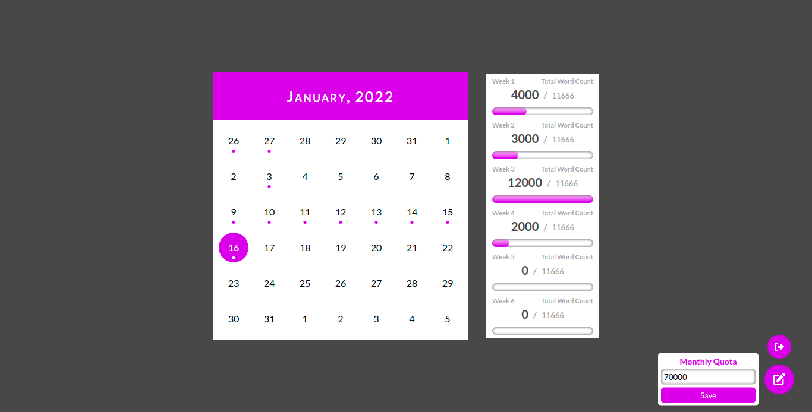

# Intoduction

This app is a Word Count Tracker that tracks the word count you've written in a specific day and enables you to see the progress of the days you've wrote something. This app is made for my partner as my partner is an author/writer so my partner needs something that can track the word counts that my partner wrote, so that's the reason I made this app.

# Setup

To set this up, we need to install the requirements first.

###### Requirements
- NodeJs
- Laravel
- Composer (Package Manager for PHP)
- Database Management (MySQL Client or PhpMyAdmin, etc)

###### Steps below to setup
- Clone this repository and cd into the directory.
- Run this command to install the required laravel packages.
  > composer update
- After that, run this command to install ReactJs for the frontend
  > npm install
- Then compile the scripts and styles in watch mode by running this command in another terminal tab.
  > npm run watch
- Now we have compiled our scripts and styles and installed the packages for both frontend and backend, now we need to setup our database to make this app work properly.
  - In order to setup the database, install or open MySQL or PhpMyAdmin if you have one and create a database.
  - After creating a database go to the root directory and make a file .env if not existed.
  - Copy the contents inside the .env.sample.
  - Paste it to the .env and configure your database setup in that file.
- After configuring the database, we can now do the migration by running this command.
  > php artisan migrate
- After a successful migration, we can then run the app by this command.
  > php artisan serve
- You will then see the url of you app and access it.
  > http://127.0.0.1:8000

Now the app is now successfully running in your local machine.